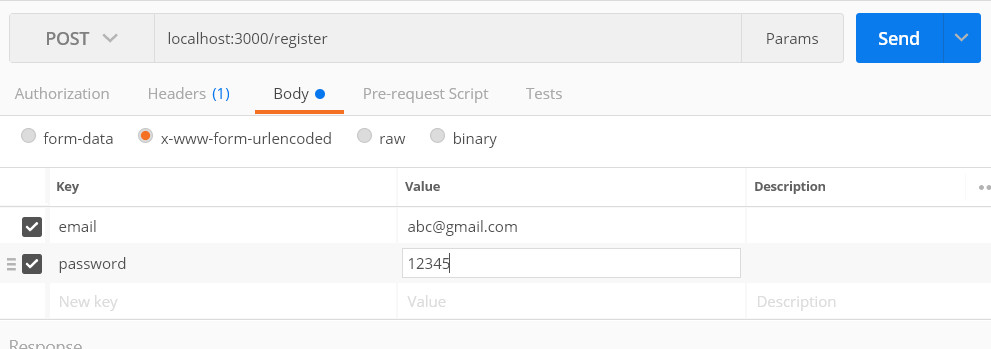
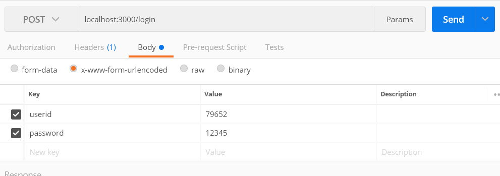
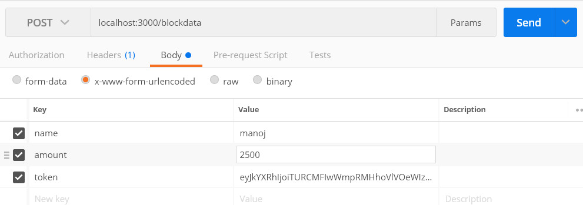
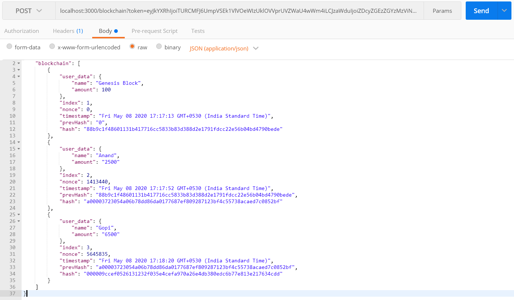

# Blockchain

Simple web application that distributes `blockchain` between registered users, and manages transaction records, thereby eliminating the need of a central Server for storing Blockchain, transaction details in any form.

> Status: Work-in-progress (Phase-4)

Note: In Phases 1 and 2 we simply create API's for testing the core blockchain functionality using REST API tool like [Postman](https://www.postman.com). 

Phase-3 will contain a basic UI that will allow user to submit data into blockchain through browser. We start implementing Decentralisation in this phase where registered users can download and upload validated blockchains into the network.

Phase-4 is where we fill up the remaining parts of decentralisation and allow manual selection of individual user IDs to transfer amount between users. 

### Phase-1 : 

	
- API for User Registeration:

	> POST request to `http://localhost:3000/register`

	

	User input should contain email address and password. In response, you should receive an unique `user ID` along with a token

- API for User LogIn:

	> POST request to `http://localhost:3000/login`

	

	
	User input will contain User ID and password. This is the User ID that was generated during email registeration process.
	If Login verification is successful, you will receive a token

- API to list all pending transactions waiting to be mined sequentially.

	To view all pending transactions for a particular userID:

	> GET request to `http://localhost:3000/transactions/{userid}`

- Maintain a dummy database containing `email`, hashed `password` and unique `userID` of registered BlockChain users.

### Phase-2 : 

- API to add transaction into block chain.

	> POST request to `http://localhost:3000/blockdata`

	

	User Input will contain `amount, name, token` (token is generated during Login, registeration process).

	This will generate individual block that will have `block index`, `timestamp`, `user data`, [nonce(PoW)](https://www.bitcoinmining.com/what-is-proof-of-work), `hash`, `previousHash`.

- API to fetch latest blockchain from network.

	> GET request to `http://localhost:3000/blockchain`

	Refer below example to see the blockchain format.

- API to submit raw JSON data containing blockchain. Each block is validated before adding it to the main BlockChain

	> POST request to `http://localhost:3000/blockchain?token={insert token here}`

	

	Once we have Logged into the network successfuly and have a copy of blockchain that was previously obtained from `GET /blockchain` API, we can send our JSON data containing blockchain into the network. The network will start validating every individual block obtained from all users, and then updates the main blockchain with the latest one.

### Phase-3 : Decentralisation [Go to this branch](https://github.com/dpak11/blockchain/tree/decentralised)

Last Update: [17 April, 2021](https://github.com/dpak11/blockchain/commit/f4af06eeb007fb8555da699779cf4fd32b99dfd9)

### Phase-4 : Decentralisation(Full) + Transact

Last Update: [21 April, 2021](https://github.com/dpak11/blockchain/tree/decentralised-transact)

---

## How to test Blockchain (Phase-1 and Phase-2):

1) Download or clone this repository into a new directory in your Local.

2) Inside the new directory, Open Windows Power Shell / Command prompt and run the command `npm install`.

3) After installation is complete, run the command `npm start`.

4) Use a REST API tool such as [Postman](https://www.postman.com) to test following:

	- First, Register with email ID and password

		> POST `http://localhost:3000/register`

	- Next, post data: `amount` and `name` along with the token that was generated during registeration

		> POST `http://localhost:3000/blockdata`

	- You can check transaction status at:

		> GET `http://localhost:3000/transactions/{userid}`

	- Once your transaction is complete and added to blockchain, you can check updated blockchain at:

		> GET `http://localhost:3000/blockchain`

